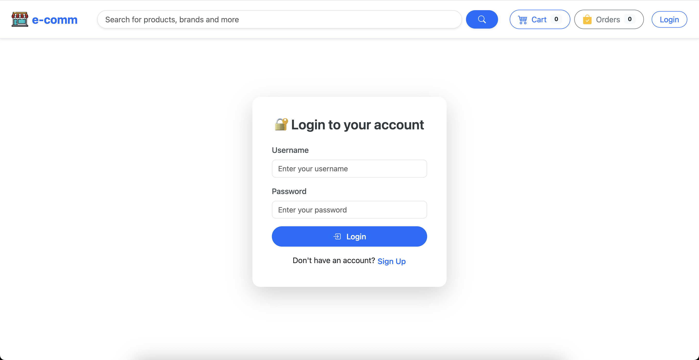
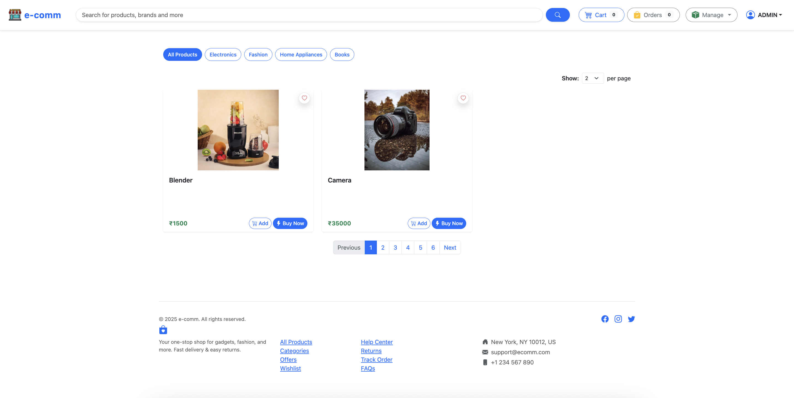
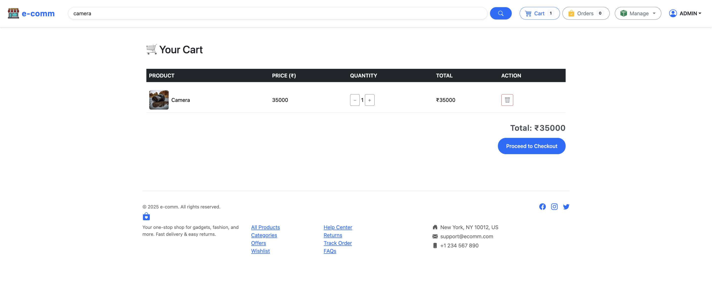
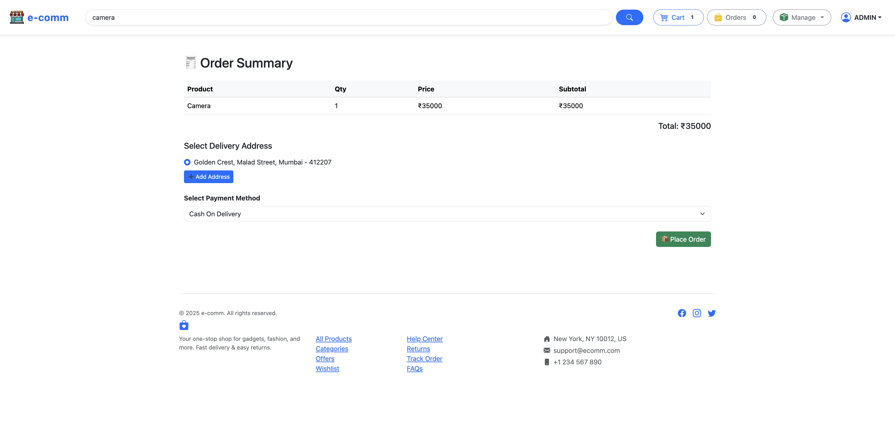
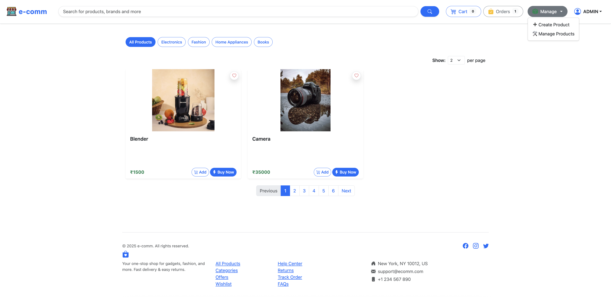
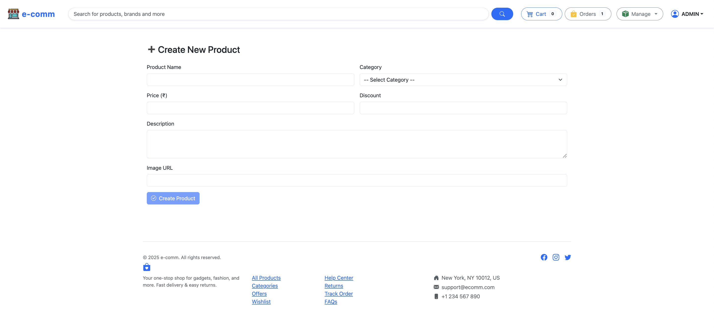
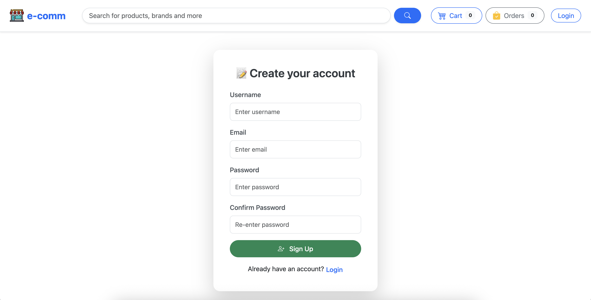
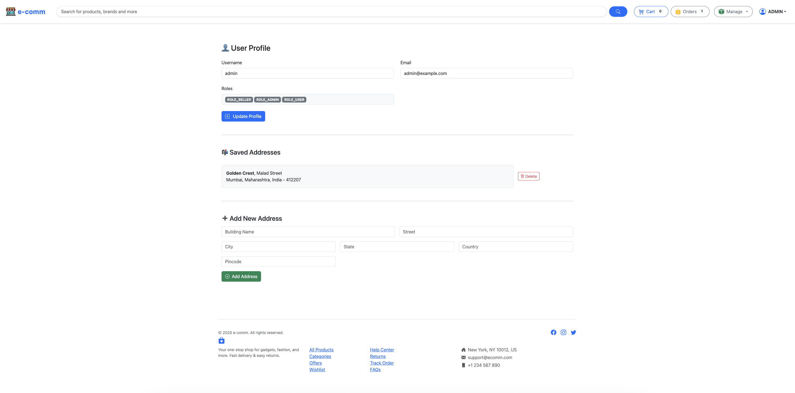
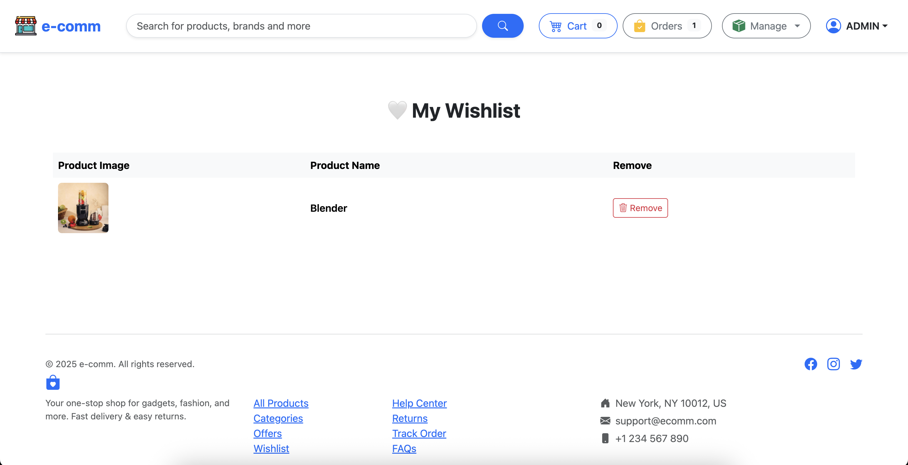
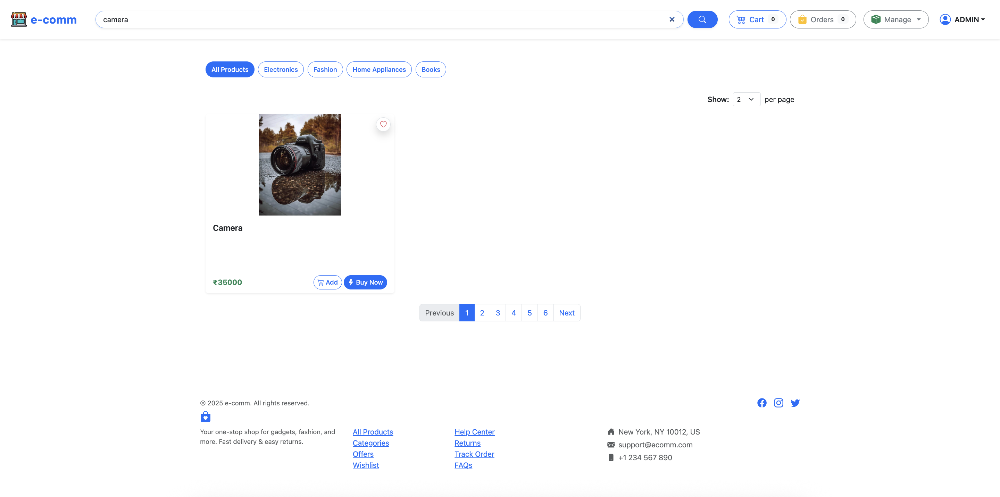

# 🛍️ E-Commerce Fullstack App

A fully functional full-stack e-commerce application built using:

- ✅ Spring Boot (Java)
- ✅ Angular (Frontend)
- ✅ MySQL / H2 Database
- ✅ Docker & AWS ready
- ✅ REST APIs with JWT Auth
- ✅ PayPal Integration

## 🚀 Features

- User Authentication & Authorization
- Product Catalog & Categories
- Shopping Cart
- Secure Checkout (PayPal)
- Order Management
- Admin Dashboard
- Mobile-Responsive Design

## 🛠️ Tech Stack

| Layer        | Tech               |
|--------------|--------------------|
| Frontend     | Angular 15+        |
| Backend      | Spring Boot 3.x    |
| Database     | MySQL / H2         |
| Build Tools  | Maven + Docker     |
| Deployment   | AWS EC2 / GitHub Pages |

## 📦 Getting Started

```bash
# Backend
cd backend/
mvn spring-boot:run

# Frontend
cd frontend/
npm install
ng serve

# Java
*.class
*.jar
*.war
*.ear
*.log
*.iml
*.db
*.h2.db
target/
out/

# Spring Boot
application.properties
application.yml

# Node / Angular
node_modules/
dist/
.env
.angular/
package-lock.json

# IDEs
*.swp
*.swo
*.bak
*.tmp
.idea/
.vscode/
.DS_Store


### **e-commerce-fullstack_springboot_angular_aws**  
🚀 Full-stack e-commerce application built with Spring Boot, Angular, Spring Security 6, JWT, and AWS deployment.  

---

## 📌 **Project Overview**  
This is a full-stack e-commerce application with the following features:  
- 🛂 **Backend:** Spring Boot, Spring Data JPA, Spring Security 6, JWT authentication, REST APIs  
- 🎨 **Frontend:** Angular, Bootstrap 5  
- ☁ **Deployment:** AWS (S3, EC2, RDS, CloudFront)  
- 🟢 **Database:** H2  
- 🔒 **Security:** JWT authentication, role-based access control  
- 🏢 **CI/CD:** GitHub Actions, Docker, Kubernetes  

---

## 🏠 **Project Structure**  
```
e-commerce-fullstack_springboot_angular_aws/
│── e-commerce-backend/                 
│   ├── src/main/java/...      
│   ├── src/main/resources/    
│   ├── pom.xml                
│── e-commerce-frontend/       
│   ├── src/                   
│   ├── public/                
│   ├── package.json           
│── README.md                  
│── .gitignore                 
│── docker-compose.yml         
```
Angular
my-app/
├── src/
│   ├── app/
│   │   ├── auth/             → Login, Register, AuthService
│   │   ├── products/         → Product list, product detail
│   │   ├── shared/           → Reusable components (navbar, footer)
│   │   ├── app.component.ts  → Root component
│   │   └── app.module.ts     → Root module
│   ├── assets/               → Images, icons, static files
│   ├── environments/         → Dev/prod configs
│   └── index.html            → Main HTML file
├── angular.json              → Project build/config info
├── package.json              → List of dependencies (NPM packages)
├── tsconfig.json             → TypeScript compiler config
└── node_modules/             → Auto-installed packages


The package.json is the heart of any NodeJS/Angular project.
"dependencies": {
  "@angular/core": "main Angular framework",
  "@angular/common": "common directives (e.g. *ngIf, *ngFor)",
  "@angular/forms": "template-driven + reactive forms",
  "@angular/router": "for page routing/navigation",
  "rxjs": "reactive extensions for async ops (used heavily in Angular)",
  "zone.js": "Angular change detection"
},
"devDependencies": {
  "@angular/cli": "Angular CLI for build/test",
  "@angular/compiler-cli": "AOT compilation",
  "typescript": "transpiles TS to JS",
  "eslint": "linting and code formatting",
  "karma/jasmine": "testing frameworks"
}

3. Build Process
When you run ng build, Angular uses:

angular.json → Project structure and build options

tsconfig.json → TypeScript compiler rules

Webpack (internally used by Angular CLI) → Bundles your app

Ahead-of-Time Compilation (AOT) → Converts templates + TS to optimized JS

🧪 4. Component & Service Communication
Example:
✅ AuthService
ts
Copy
Edit
@Injectable({ providedIn: 'root' })
export class AuthService {
  login(credentials: any) {
    return this.http.post('/api/login', credentials);
  }

  isLoggedIn(): boolean {
    return !!localStorage.getItem('token');
  }
}
✅ LoginComponent
ts
Copy
Edit
export class LoginComponent {
  constructor(private auth: AuthService) {}

  ngOnInit() {
    if (this.auth.isLoggedIn()) {
      // navigate
    }
  }
}
🔥 If AuthService doesn’t have isLoggedIn(), TypeScript will give error:
TS2339: Property 'isLoggedIn' does not exist on type 'AuthService'

🛠️ 5. Fixing Common Angular Errors
❌ Error	✅ Reason	🧪 Fix
TS2339: Property does not exist	You are calling a method/property that is missing in the class	Add it to the service or fix the usage
NG0303: Can't bind to property	You're binding to an invalid property in the HTML	Use correct Angular syntax and properties
Cannot find module	Path to file is wrong	Fix the import path
ExpressionChangedAfterItHasBeenCheckedError	You changed a value after rendering	Use ChangeDetectorRef or set value before ngAfterViewInit

📚 6. Learning Path for You (Angular Essentials)
📘 Topic	✅ Why Important
Angular CLI (ng serve, ng build)	Build, run, and generate files
Modules & Components	Core structure of Angular apps
Services & Dependency Injection	Share data/functions across components
Routing & Navigation	Switch between pages
Forms (Template-driven vs Reactive)	Handle user inputs
State & Local Storage	Save JWT token, user info
HTTPClient & APIs	Connect frontend to backend
Error Handling	Debug and fix real issues
Deployment (Optional)	Host on Firebase, AWS, etc.

📦 Recommended Package Folder Structure (Real Project)
css
Copy
Edit
src/
├── app/
│   ├── core/              → AuthService, Interceptors, Guards
│   ├── auth/              → Login, Register, AuthModule
│   ├── products/          → Product List, Details, ProductService
│   ├── shared/            → Reusable UI Components (navbar, button)
│   ├── app-routing.module.ts
│   └── app.module.ts
---

## 🚀 **Installation & Setup**  

### **1️⃣ Clone the Repository**  
```sh
git clone https://github.com/dinesh-more/e-commerce-fullstack_springboot_angular_aws.git
cd e-commerce-fullstack_springboot_angular_aws
```

### **2️⃣ Backend Setup**  
- **Navigate to Backend Folder:**  
  ```sh
  cd e-commerce-backend
  ```
- **Configure Database:** Update `application.properties` or `application.yml`  
- **Run the Application:**  
  ```sh
  mvn spring-boot:run
  ```

### **3️⃣ Frontend Setup**  
- **Navigate to Frontend Folder:**  
  ```sh
  cd e-commerce-frontend
  ```
- **Install Dependencies:**  
  ```sh
  npm install
  ```
- **Start Development Server:**  
  ```sh
  ng serve
  ```

---

## 💽 **API Endpoints**  
| Method | Endpoint                     | Description                   |
| ------ | ---------------------------- | ----------------------------- |
| POST   | `/api/auth/signup`           | User registration             |
| POST   | `/api/auth/login`            | User login                    |
| POST   | `/api/products`              | Create a product              |
| GET    | `/api/products`              | Get all products              |
| GET    | `/api/products/{id}`         | Get product by ID             |
| PUT    | `/api/products/{id}`         | Update product by ID          |
| DELETE | `/api/products/{id}`         | Delete product by ID          |
| POST   | `/api/cart`                  | Add product to cart           |
| GET    | `/api/cart`                  | Get cart items                |
| DELETE | `/api/cart/{productId}`      | Remove product from cart      |
| POST   | `/api/orders`                | Place an order                |
| GET    | `/api/orders`                | Get all orders for user       |
| GET    | `/api/orders/{orderId}`      | Get order details             |
| PUT    | `/api/orders/{orderId}/pay`  | Mark order as paid            |
| PUT    | `/api/orders/{orderId}/ship` | Mark order as shipped (admin) |
| GET    | `/api/users`                 | Get all users (admin)         |
| GET    | `/api/users/{userId}`        | Get user details (admin)      |
| PUT    | `/api/users/{userId}`        | Update user (admin)           |
| DELETE | `/api/users/{userId}`        | Delete user (admin)           |

---
#Dockersetup
ecommerce-project/
├── e-commerce-backend/
│   ├── Dockerfile
│   ├── pom.xml
│   └── src/
├── e-commerce-frontend/
│   ├── Dockerfile
│   ├── angular.json
│   └── src/
├── docker-compose.yml
└── Jenkinsfile


## 🛠 **Tech Stack**  
### **Backend:**  
- Spring Boot  
- Spring Data JPA  
- Spring Security 6 & JWT  
- H2  
- Hibernate  
- Maven  

### **Frontend:**  
- Angular    
- Bootstrap 5

### **Cloud & DevOps:**  
- AWS S3, EC2, RDS, CloudFront  
- Docker & Kubernetes  
- CI/CD with GitHub Actions  

---

## 📌 **Future Enhancements**  
- ✅ Payment Gateway Integration (Razorpay/Stripe)  
- ✅ Admin Dashboard  
- ✅ Product Recommendations with AI  

---

## Screenshots
### Login 
 
### Product List
 
### Cart
 
### Checkout
 
### My Orders
 
### Create and Manage Products (ADMIN)
 
### Create Product (ADMIN)
 
### Manage Product (ADMIN)
 
### Signup
 
### User Profile
 
### Wishlist
 
### User Options
 
### Search

---

## 🤝 **Contributing**  
Feel free to fork this repo, raise issues, and submit pull requests! 🎉  

---

## 📝 **License**  
This project is licensed under the MIT License.  
