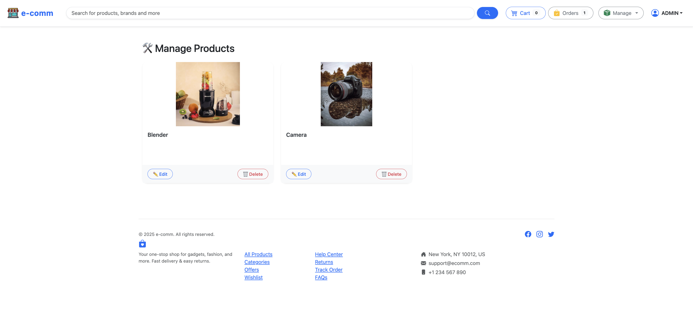

### **e-commerce-fullstack_springboot_angular_aws**  
🚀 Full-stack e-commerce application built with Spring Boot, Angular, Spring Security 6, JWT, and AWS deployment.  

---

## 📌 **Project Overview**  
This is a full-stack e-commerce application with the following features:  
- 🛂 **Backend:** Spring Boot, Spring Data JPA, Spring Security 6, JWT authentication, REST APIs  
- 🎨 **Frontend:** Angular, Bootstrap 5  
- ☁ **Deployment:** AWS (S3, EC2, RDS, CloudFront)  
- 🟢 **Database:** H2  
- 🔒 **Security:** JWT authentication, role-based access control  
- 🏢 **CI/CD:** GitHub Actions, Docker, Kubernetes  

---

## 🏠 **Project Structure**  
```
e-commerce-fullstack_springboot_angular_aws/
│── e-commerce-backend/                 
│   ├── src/main/java/...      
│   ├── src/main/resources/    
│   ├── pom.xml                
│── e-commerce-frontend/       
│   ├── src/                   
│   ├── public/                
│   ├── package.json           
│── README.md                  
│── .gitignore                 
│── docker-compose.yml         
```

---

## 🚀 **Installation & Setup**  

### **1️⃣ Clone the Repository**  
```sh
git clone https://github.com/dinesh-more/e-commerce-fullstack_springboot_angular_aws.git
cd e-commerce-fullstack_springboot_angular_aws
```

### **2️⃣ Backend Setup**  
- **Navigate to Backend Folder:**  
  ```sh
  cd e-commerce-backend
  ```
- **Configure Database:** Update `application.properties` or `application.yml`  
- **Run the Application:**  
  ```sh
  mvn spring-boot:run
  ```

### **3️⃣ Frontend Setup**  
- **Navigate to Frontend Folder:**  
  ```sh
  cd e-commerce-frontend
  ```
- **Install Dependencies:**  
  ```sh
  npm install
  ```
- **Start Development Server:**  
  ```sh
  ng serve
  ```

---

## 💽 **API Endpoints**  
| Method | Endpoint                     | Description                   |
| ------ | ---------------------------- | ----------------------------- |
| POST   | `/api/auth/signup`           | User registration             |
| POST   | `/api/auth/login`            | User login                    |
| POST   | `/api/products`              | Create a product              |
| GET    | `/api/products`              | Get all products              |
| GET    | `/api/products/{id}`         | Get product by ID             |
| PUT    | `/api/products/{id}`         | Update product by ID          |
| DELETE | `/api/products/{id}`         | Delete product by ID          |
| POST   | `/api/cart`                  | Add product to cart           |
| GET    | `/api/cart`                  | Get cart items                |
| DELETE | `/api/cart/{productId}`      | Remove product from cart      |
| POST   | `/api/orders`                | Place an order                |
| GET    | `/api/orders`                | Get all orders for user       |
| GET    | `/api/orders/{orderId}`      | Get order details             |
| PUT    | `/api/orders/{orderId}/pay`  | Mark order as paid            |
| PUT    | `/api/orders/{orderId}/ship` | Mark order as shipped (admin) |
| GET    | `/api/users`                 | Get all users (admin)         |
| GET    | `/api/users/{userId}`        | Get user details (admin)      |
| PUT    | `/api/users/{userId}`        | Update user (admin)           |
| DELETE | `/api/users/{userId}`        | Delete user (admin)           |

---

## 🛠 **Tech Stack**  
### **Backend:**  
- Spring Boot  
- Spring Data JPA  
- Spring Security 6 & JWT  
- H2  
- Hibernate  
- Maven  

### **Frontend:**  
- Angular    
- Bootstrap 5

### **Cloud & DevOps:**  
- AWS S3, EC2, RDS, CloudFront  
- Docker & Kubernetes  
- CI/CD with GitHub Actions  

---

## 📌 **Future Enhancements**  
- ✅ Payment Gateway Integration (Razorpay/Stripe)  
- ✅ Admin Dashboard  
- ✅ Product Recommendations with AI  

---

## Screenshots
### Login 
 
### Product List
 
### Cart
 
### Checkout
 
### My Orders
 
### Create and Manage Products (ADMIN)
 
### Create Product (ADMIN)
 
### Manage Product (ADMIN)
 
### Signup
 
### User Profile
 
### Wishlist
 
### User Options
 
### Search

---

## 🤝 **Contributing**  
Feel free to fork this repo, raise issues, and submit pull requests! 🎉 

---

## 📝 **License**  
This project is licensed under the MIT License.  
